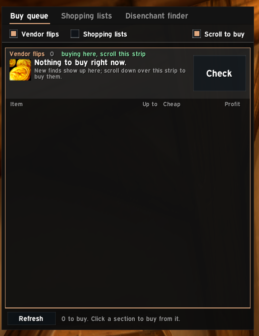
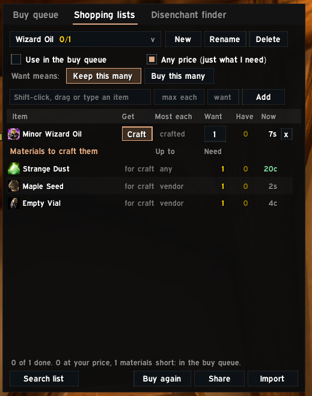

# Forever Ledger guide

Everything the addon does, at a high level. The same text is in the game under **/fl → Help**. For what changed in each version see the [changelog](../CHANGELOG.md); for what's coming, the [roadmap](../ROADMAP.md).

> Pictures are being added. Where a picture is missing, the text still describes the feature.

## Getting started

1. Type `/fl` (or click the minimap button) to open the main window.
2. Open each profession window once on every character, so the addon learns your recipes.
3. At the auction house, click **Full scan** (allowed about every 15 minutes) to price everything.
4. Hover any item: the tooltip shows what it's worth to you.

The first time you open the window, a short welcome walks through these and the Buy queue, Deals and Shopping lists. Show it again with the button under the Help tab's list of topics, or with `/fl welcome`. After an update, chat lists what's new in that version once; the **What's new** button (bottom right of Help and the Dashboard) or `/fl new` shows it as a card.

Settings and Help each have a **search box** above their list: type two letters or more to see everything that mentions it, from every section at once.

**Settings** has a sidebar like EllesmereUI's options: **Global settings** first (the same for every character: the auction house cut, safety margin, seconds per craft, price source, and what counts as a vendor flip or a deal), then **Profiles**, then a page for each part of the addon (Auction house, Tooltips, Customers, Waylaid Crates, Sessions, Minimap and updates), with tabs across the top where a page has several parts.

**Themes** (Settings, Appearance): **FL Clean** (flat and quiet), **FL Default** (a bronze edge, gold titles, sections as cards, switches) or **FL Gilded** (a bronze frame and gold serif titles), each with an **accent colour**: Auto uses EllesmereUI's colour when it's installed; or pick one of the colours, or Custom for any. A new look shows after a reload, which it offers. **Size** makes the windows smaller or bigger, from 75% to 150% (drag the slider, then let go). The theme and size are part of your profile, so a character can look different.

**Profiles**: a profile is a set of settings your characters can share: no tooltips on one character, no customer finder on another. Each character uses one, **Default** to start; pick another in the dropdown. **New profile** starts as a copy of your settings now and switches to it; **Rename**, **Reset to defaults** and **Delete profile** (click twice) work on the profile this character uses. **Export / import** opens one window: its Export tab copies the profile as text with only the parts you tick, and its Import tab makes a new profile from someone's text (only settings travel, never your data). Global settings are never in a profile.


## Scanning the auction house

- **Full scan** reads every listing in a few seconds. **Scan materials** checks just what your recipes use.
- **Watch flips** keeps scanning while the auction house stays open and chimes when a new vendor flip turns up. The game only lets addons search with the auction house open, so the watch pauses when you close it and picks up again when you come back (Settings, Auction house: **Resume the flip watch**).
- If Auctionator or another addon runs a full scan, Forever Ledger reads it too.
- **With Auctionator, TSM or ForeverForge installed**, Forever Ledger switches off the features they already cover, so you don't see things twice: the auction and vendor price lines in tooltips (Worth to you, Buy at or below and the rest stay), and with ForeverForge the sound when an auction sells. A one-time message says what was turned off; **Keep them on** undoes it, and Settings can change it any time.
- **New versions**: when a guildmate or group member has a newer Forever Ledger, chat says so once a session ("Version 0.12.0 is available..."). Addons can't check online, so copies tell each other; only the version number is shared, and Settings, Minimap and updates turns it off.
- **Your auctions**: the **Auctions** tab beside the auction house, with **All**, **Up**, **Undercut** and **Sold** views like the Ledger. Each auction shows how many, your price each, the cheapest now, and **undercut** (red) or **cheapest** (green); sold ones show what you get after the cut and when the gold reaches your mailbox (about an hour after the sale). The bottom line says the gold on the way and what's waiting in your mailbox (as of your last visit). **Check prices** looks them all up at once; full scans and the flip watch check them too, and an undercut gets a chat line and a sound, once each login as a reminder (Settings, Auction house: Undercut alerts; they start off with Auctionator or TSM, which have their own). **Cancel next undercut** asks once, then each click cancels the next undercut auction, always from the same button; each loses its deposit, and the items come back by mail to repost just under the cheapest. A Cancel on each undercut row (click twice) does just that one. Opening the auction house says in chat what sold while you were away and the gold it brings (Settings, Auction house, "What sold while you were away").
- **Sale sound**: a coin sound when one of your auctions sells (Settings, Auction house: **Sound when an auction sells**).
- Neutral auction houses (Booty Bay, Gadgetzan, Everlook) keep their own prices.
- **Price helper**: on the Sell tab, under the Create Auction button: your usual price and the cheapest now, with **Undercut** (1 copper under the cheapest) and **Usual** buttons that fill the price in. When the cheapest is well below usual (someone dumping), it says so, so you can wait instead of following it down. You still click Post. Settings, Auction house turns it off; it starts off with Auctionator or TSM, which set prices their own way.
- **Sell protection**: on the Sell tab, if a vendor pays more than your listing would bring after the auction house cut, a red line under **Post** says so and Post is greyed out until you click **Post anyway**. Untick **Stop posts below vendor price** in Settings (Auction house) to keep just the warning.


## Tooltips

- **Auction price**: **Auction, cheapest** is the lowest price listed at your last scan, with how many were listed and (in grey) how long ago. Under it, when it differs, **avg of cheapest 20**: about what you'd pay buying a few. Forever Ledger's values use that average, so one odd cheap listing doesn't sway them. If your own prices are more than 12 hours old and you have Auctionator or TSM, their price is used instead and named.
- **Worth to you**: the best of selling on the auction house, selling to a vendor, disenchanting, or crafting it into something, with the best few ways listed.
- **Buy at or below**: the most worth paying, after your safety margin. Green when it's already cheaper.
- Also: disenchant results, which of your recipes use it, and the cheapest crate fill.
- Gear with random stats ("of the Eagle"): the price of that exact version, since versions of one item can sell for very different amounts.
- **Sells**: how fast an item sells: **Fast**, **Steady**, **Slow**, **Rare** (seldom listed, but goes quickly when it is) or **No sales seen**, with about how many are bought a day and how many are usually listed. It's judged against items of the same kind (materials are expected to move in bulk, gear slowly), so "4 a day with 5 listed" beats "100 listed and none selling". The auction house never says what sold, so it counts listings that vanished between two full scans before they could have expired (each listing's time left tells), and leaves out ones that were reposted cheaper. It builds up as you run full scans, fastest with Watch flips running, and shows after 3 hours of scans compared (and, in the first day, at least 3 sales). The Deals tab has it as a column too.
- **Quests**: items quests ask for (Bronze Tube, Spider Ichor, Flask of Oil and about a hundred more) show the quest, its level and how many, for your faction. The line is yellow and says **keep it** when this character hasn't reached that level yet, so you don't sell what you'll need. Quests the character has already done (read from the game's list of completed quests), ones grey for its level, and other classes' quests are left out; untick **Only quests this character still needs** in Settings to see them all, marked. Leveling players buy these once per character, which makes them good to sell, especially in the first weeks after launch; a deal's hover on the Deals tab says when it's a quest item. The list comes from original Classic quests, so Forever may have changed some.
- **Price history**: hold **Ctrl** over an item for the cheapest price over the last 14 days, whether it's rising or falling, the usual price this month, how many are usually listed and the lowest price ever seen. It builds up with each scan.
- **Bags**: a bag's tooltip shows what one slot costs at today's cheapest price (auction house or vendor) and the cheapest bag per slot right now, so you buy the cheapest space first.
- **Settings → Tooltip size**: "One line, Shift for more" keeps tooltips short. Each part can be turned off.


## Shuffles and vendor flips

- **Shuffles**: buy materials, craft, disenchant or convert, and sell, ranked by profit per hour. Click a row for every step.
- **Vendor flips**: things on the auction house for less than a vendor pays. They're bought from the **Buy queue** beside the auction house (below): a full scan that finds some opens it if it's closed, and the flip watch chimes when a new one turns up. Settings, **Vendor flips** sets the least profit worth your time: a share of the vendor price (0% counts anything below it) and an amount each (say 10c). On the auction house, listings worth buying get a green bar and a **BUY** badge, and the line above the list says how many are still there (red "None left" once they've been bought).

## Buy queue and shopping lists

- **Buy queue**: click **Buy queue** under the auction house. A panel beside it lines up vendor flips and items from your shopping lists. (Greens worth disenchanting are in the Disenchant finder, with their item levels; deals are on the Deals tab.) The addon looks up the next one by itself; **a click on Buy buys it**, or with **Scroll to buy** ticked, a tick of the mouse wheel down over the section's top strip. Stacks of materials take a second tick: the first asks the auction house for the final price, the second confirms it. `/fl queue` opens it.
- **Two views**: Vendor flips or Shopping lists, switched at the top of the panel, one at a time. The view you're on is the one that buys, so a shopping list never buys a flip by accident; each has its own strip at the top ("Buy Edged Bastard Sword for 9s", with a Buy button when there's something to buy) and its own buttons at the bottom (Watch flips, Full scan and Scan materials; or Search my lists and Full scan). When there is something to buy, the strip at the top glows (gold for Vendor flips, purple for Shopping lists); with **Scroll to buy** ticked it also shows a mouse wheel: that's where to scroll. Scans and the flip watch add to the lists but never switch the view; new flips found while you're on Shopping lists show a gold count on the Vendor flips button (and on the Buy queue tab).
- **Farming flips**: tick only Vendor flips, tick **Scroll to buy**, and leave the mouse over the flips strip. When the flip watch chimes, scroll down to buy; an empty section just waits for the next one.
- **Safe by design**: it never pays more than the limit shown (checked again against the final price) or more than you have, and every purchase is your own tick or click, as Blizzard requires. **Scroll to buy** starts off; it only works over the top strip of the section you're buying from. Click a row to buy that one next; right-click to skip it. Gear sold in stacks is left for you to buy on the page. Items you can't afford yet stay at the bottom of the list, greyed and marked **can't afford**, and are skipped until you have the gold. Scroll past the last one you can buy and you get the error sound and a red "That's everything you can buy", once.
- **Spend at most**: the box near the bottom of the Buy queue caps what it spends this auction house visit (type 50 for 50g; it starts again each time you open the auction house). It says **no limit** until you type something. Beside it, what's left: teal, yellow when nearly gone, red **limit reached**. Items over what's left are marked **over limit** and skipped. To always keep some gold back (repairs, a mount), set **Buy queue: always keep** in Settings, Auction house. Purchases you make yourself on the auction house page don't count towards either.
- **Scanning from the panel**: the bottom row has **Watch flips**, **Full scan** and **Scan materials** (they turn into Stop buttons while running), with the scan's progress just above. While the panel is open beside the auction house, the same buttons under the auction house window are hidden. With nothing to buy, the big button starts the flip watch.
- **Alerts**: new finds chime, are listed in chat, and show in large text at the top of the screen. If that text covers your windows, untick **Big message on screen** in Settings.



- **Shopping lists**: named lists of items, for example twink gear to watch for or raid consumables to buy. Pick a list from the dropdown at the top (New, Rename and Delete are beside it). With the list open, shift-click an item from your bags or a chat link to add it, drag it in, or start typing its name and pick from the suggestions (Enter takes the top one). Suggestions include items the game hasn't loaded yet, from original Classic. Open your lists anywhere (a window you can move) to plan before you go to the auction house: the **Shopping lists** button at the top of the main window, Shift-click on the minimap button, or `/fl lists`.
- **Search all** checks the auction house for everything on the list at once. Each item shows when it was checked (**checking...** and **in line** while it runs), how many are listed and the cheapest. Click an item to look at it on the auction house and buy by hand.
- **Have**: what you own of each item: this character's bags, bank and auction house purchases still in the mail, and your characters on the same ruleset and faction (as of their last login). Hover the number to see where. On a list you buy from it reads **3 (20)**: 3 bought for the list, 20 owned. It's there so you know; it doesn't change what's bought.
- **Buying from a list**: tick **Buy from this list in the Buy queue**. The list adds **Want** (how many to buy) and **Up to** (the most you'll pay for one: filled in with your usual price from scans when you tick the box or add an item, and yours to change; **off** means don't buy it), and the Buy queue's Shopping lists view buys them. Want is how many to *buy*, whatever you already have; **Have** shows how many are bought so far (on the auction house, from the queue or by hand), and the queue never buys more than Want, checked against the list right before each purchase. An item is **done** once its Want is bought and stays done, saved through reloads, so the queue doesn't keep buying it. The list's name shows how many are done (3/5), the bottom line says about what buying the rest would cost, and **Complete** when it's all bought. Lists are kept until you delete them: next raid, check Have, adjust Want and click **Buy again** (bottom right) to start over.
- **One version**: type "Soldier's Armor of the Monkey", or shift-click a link of that version, to keep just that version on a list. Search all looks up every version of a piece of gear; hover an item for each version's price, yours first.
- **Craft or buy**: hover an item one of your recipes makes to see what buying it would cost against buying the materials to craft it (counting the materials you already have), and which is cheaper.
- **Share and Import**: **Share / import** (top right of the list) opens a window with two tabs. **Share** copies a list as plain text, ready to paste in the Discord (put it between ``` marks) or send to a friend. **Import** reads shared lists back, and also takes a plain list of item names, item numbers or Wowhead links, one per line. Imports never change your own lists (one with the same name is added as a new list) and never buy by themselves: tick Buy from this list to buy from one. A shared list looks like this, and you can write one by hand:

  ```
  Forever Ledger shopping list: Raid prep
  any price
  13510 Flask of the Titans | want 2
  2772 Iron Ore | max 1g 50s | want 20
  13511 Flask of Distilled Wisdom | craft | want 3
  ```
- **Prices**: type them any way you like: `2g 50s 25c`, `2 50 25` or `2.50.25` (gold silver copper), `2 50` (gold silver), `25s`, `75c`, or a plain number for gold. A tip shows what it will be saved as, and Enter tidies it up. Type `any` to take any price for one item, or tick **Any price** (bottom of the list) for the whole list, for raid prep where you just have to eat the cost: the buy queue then buys the cheapest ones until it has bought the number you want (1 if you didn't set one), and never more than 3 times the usual price, so a joke listing can't slip in.
- **Buy or craft**: on a list you buy from, items one of your recipes makes have a **Buy/Craft** button; others just buy. Planning to make 10 Wizard Oils instead of buying them? Set it to Craft and the list shows the materials for the number you want, how many are bought of each, and **Up to** for each: your usual price from scans unless you type your own. Materials a vendor sells are marked **vendor**. Search all checks the materials too.
  If none of your characters knows the recipe, the original Classic recipe is used (hover the item to see it); Forever may have changed some.
- Items at or under your price join the Buy queue; ones not cheap enough yet wait at its bottom, greyed, so you can see they're being watched.
- The panel's third tab is the **Disenchant finder** (below).



## Deals

- **Deals tab**: listings well below the price an item is usually *cheapest* at, to buy and resell. Each row shows the price now, the usual low (the middle of each day's cheapest price over the period set in Settings), how far below it is, how many are worth buying, the profit after the auction house cut (each and for all of them), and how sure the deal is: **Good**, **Fair** or **Thin**. Comparing with the usual cheapest price, not the typical one, means a deal is a real bargain, not just today's normal low.
- **Hover a deal** to see why it's a deal: the usual cheapest and typical prices, how many days they're based on, the typical range most days, how many are usually listed, and the next listing above the cheap ones. Profit assumes you resell at the usual cheapest price, or just under the next listing if that's lower, and only listings that still make the minimum profit count. **Click** a deal to search for it on the auction house.
- **How sure**: Good means a week or more of steady prices. Fair means less data, or a warning: usually only one listed (it may sell slowly, or that "usual price" was one hopeful seller), nothing else listed to compare with, or gear whose stat versions sell at different prices. Thin (a few days, or prices that jump around) is hidden unless you tick **Show thin data too**.
- Deals need at least 4 days of scans to know an item's usual price, or TSM installed. Settings, Global settings, Flips and deals sets how far below, over what period, and the least profit each. After a scan, chat says how many new deals there are instead of listing them.
- **Filter** the list by kind (All, Materials, Gear, Other) or search by name.
- **A dropped price isn't a deal**: when half or more of what's listed is that cheap, the item has simply got cheaper (say, essences once everyone can disenchant them), so it's rated Thin and says so.
- The auction house only shows what's listed, not what sold. Buy what you'd be happy to hold for a while.

## Disenchanting

- **Disenchant finder** (beside the auction house: Buy queue button, Disenchant finder tab): green armor and weapons in the item levels you pick (the **Item levels** dropdown, with Select all and Deselect all; Armor, Weapons and Only worth disenchanting filter the list), with what each is worth to disenchant. Hover a level in that list for the odds of each material and what a bad and a good roll would bring. The worth is an average over many disenchants (Settings, Auction house can hide the rolls).
- `/fl de` shows your own disenchanting results against the expected odds.


## Recipes and trainers

- **Recipes tab**: every recipe of your professions, who knows it, where to get it, the skill needed, and profit per craft. Types: Flip or shuffle, Crafts that sell, Enchant service, Not for sale, Not profitable. Right-click a recipe to set your own type. Click a column heading to sort.
- **Where from**: what you've seen in game first, otherwise original Classic data marked "(Classic)", or the auction house when the recipe item is listed there (handy for recipes new in Forever). **Pin** puts a map pin on the vendor, trainer or mob.
- **Trainers view**: trainers you've visited, Classic ones, and the spots city guards mark when you ask them for a profession trainer (marked "guard").


## Waylaid Crates

- **Crates tab**: the cheapest way to fill each crate at today's prices, with the crate's own price and gold per Merchant's Favor. Click a crate for every bundle and what you already have in bags, bank and alts.
- **What a turn-in pays**: every filled crate becomes a Sealed Apprentice Crate. After your first turn-in (a one-time quest), each one pays **5s and 10 Merchant's Favor**, whatever the crate. Net cost takes the 5s off, and shows green if a crate somehow pays for itself.
- **Shopping list for a crate**: open a crate and click **Add cheapest fill to a shopping list**. The crate and its items go on a list named after the crate, with prices high enough to buy them all at your last scan. What you already have counts towards a crate list's Want (only crate lists do this). Tick **Buy from this list in the Buy queue** on it and the Buy queue buys what you're short. Set the crate's Want to fill several at once: every item's Want follows it. The list is temporary: each crate you fill takes one off, and the list goes with the last one (or after a week).
- Crates are sold at the turn-in posts too (Three Corners in Redridge for Alliance, near the Crossroads for Horde), and Merchant's Favor buys recipes, pets, tabards, titles and even a mount.


## Customers and work

- **Customers window** (`/fl customers`): opens when someone in chat asks for what your character can do, with **Whisper** and **Invite** buttons.
- **Silence**: the button at the bottom right of the Customers window quiets the alerts: **until you're next in a capital city**, **until you reload**, **until you log out**, or **always** (that turns the customer finder off; **Turn alerts back on** in the same menu, Settings, or `/fl customers on` brings it back). While quiet, requests are still listed in the window, just with no pop-up, sound or chat line; the window's bottom line says until when.
- **Class services**: the finder also spots requests for Mage food, water and portals (portals from level 40), Warlock summons (from level 20) and Rogue lockpicking (from level 16), when you're on that class. **Settings, Customers** turns each service (and crafting requests) on or off, along with its ad button; the Customer finder switch turns the whole thing off.
- **Ad buttons** post your crafting (with profession links) to Trade, plus a button per class service: food and water (with links), portals (with the cities you know), summons, or lockpicking. Right-click a button to change its text.
- **Work done** (`/fl work`): enchants and paid trades, with today's and this week's earnings.


## Your gold

- **Dashboard**: the first thing you see. Along the top, your gold now and how it changed, profit, sales and expenses for the range you pick (Day to All time); the gold graph (hover for any moment) with its high and low; the most profitable item and the biggest sale and purchase; how much you trade a day; and your sessions as a table (when, length, gold, looted, gold an hour). **Start a session** is next to the character list.
- **Ledger**: **All** lists every transaction in one place: auction and vendor sales and purchases, and other money like repairs, mail, loot, quests and flights (those by day), money in green and out in red. **Sales**, **Purchases**, **Resale** (profit on items you both bought and sold) and **Other** show one kind each. Filter by time, character or a word, click a heading to sort, and hover a row for the details (the item's own tooltip where known).
- **Characters**: your characters on this realm and faction down the left with their gold; the dropdown above them shows another realm or faction, both factions of a realm, or all realms (only characters on the same realm and faction share an auction house). Pick one to see its professions and everything in its bags and bank, each item with what it's worth to you and the best way to turn it into gold (sell on the auction house, to a vendor, disenchant or craft), sortable by any column. **All characters** adds up everyone in the group you picked (hover an item to see who has it, or a character for its gold and what its bags and bank are worth), and the search box finds an item on any of them. **Each** is what one is worth to you: the best of the auction house after the cut, a vendor, disenchanting or crafting. The bottom line says what the list is worth; hover it to see each character's part. Bags are as of each character's last login, the bank as of its last bank visit.
- **Sessions list**: the Ledger's **Sessions** sub-tab (or **See all sessions** on the Dashboard) lists every session: when, length, gold, what you looted, gold an hour and the character, sortable. Hover one for where its gold came from and the best loot. Sessions before October 4 don't know their character, so they show under every character.
- **Totals of rows**: select rows to see what they add up to: click one, **Shift-click** another for everything between, **Ctrl-click** to add or take one, or press and **drag** across rows. The bottom line shows the money in, out and the net of what's selected; right-click a row or **Clear selection** to start again.
- **Sessions**: start one with **Start a session** at the top of the Dashboard, Ctrl-click on the minimap button, or `/fl session start`, and a small tracker you can drag counts what your time is worth: gold in and out by where it came from, what you loot (at the better of auction price after the cut and vendor price; Settings, Sessions can make it vendor only) and gold per hour (in larger text). Right-click the tracker to fold it to one slim line. Stop it (the tracker's Stop, or `/fl session stop`) for a summary in chat with the best loot; it joins the Dashboard's list of sessions. A session carries on through a logout on the same character.
- **Dungeon runs**: counted as you go, in a session or not. Each dungeon keeps how many runs, the time, the coin looted and what dropped for you; going back in within 5 minutes (after a wipe, say) is the same run. `/fl runs` lists them with the best drops, and item tooltips say how often something dropped for you ("Dropped for you: Deadmines, 2 in 14 runs").
- **How long it's kept**: market and money history goes stale, so it's summed up as it ages and the saved file doesn't grow forever:

  | What | Kept |
  |---|---|
  | Sales and purchases | One by one for 30 days, then one line per item per month for a year |
  | Gold and money in and out | Per day for a year, then per month |
  | Prices | Per day for 14 days, then weekly averages for a year |
  | Recipes, vendors, items, your characters | For good |

  Nothing is lost at a reload: only data past these ages is summed up or dropped.


## Sharing between accounts

- **Live sync** (`/fl pair First Last`) sends prices and recipes between your two accounts while both are online. Export and import work too.

## Common questions

The in-game Help tab has these under each topic too.

**Getting started**
- *Does it buy or sell anything by itself?* No. Every purchase and auction is your own click (or wheel tick), as Blizzard requires. Forever Ledger finds, suggests and queues.
- *Why are some things empty on the first day?* Prices and flips work from your first full scan. Deals and how fast things sell need a few days of scans to know what's usual.

**Scanning the auction house**
- *Why can't I run a full scan?* The game allows one about every 15 minutes. The Full scan button counts down to the next.
- *Does Watch flips work with the auction house closed?* No: the game only lets addons search with the auction house open. The watch pauses when you close it and picks up when you come back.
- *What are the 120 items the watch re-checks?* Between full scans, the items whose price was closest to what a vendor pays: the likeliest to turn into flips when someone lists one cheap.

**Tooltips**
- *Why does it say none listed?* Your last scan found none of that item on the auction house.

**Buy queue and shopping lists**
- *Do I click the big button or a row?* Either. The big button (or the wheel over its strip, with Scroll to buy ticked) buys the next one. Clicking a row buys that one next.
- *Why did items disappear from the queue?* Someone else bought them first, or their price is too old: finds over 15 minutes old are left out until a scan finds them again. Items you can't afford stay at the bottom, marked.

**Deals**
- *Why are there no deals?* A deal needs an item's usual price, so at least 4 days of your scans (or TSM). Keep scanning; they fill in.

## Help and community

- **Discord:** [discord.gg/WKsCtvupeC](https://discord.gg/WKsCtvupeC) for updates, questions and WoW Forever news.
- **Found a bug?** Type **/bug** on the Discord and fill in the short form (version, what happened, how to make it happen). Add the `/fl api` output or the BugSack error if you can. It goes to our tracker and you'll get updates in your post.
- **Have an idea?** Type **/feature** on the Discord.

## Your data

- Everything Forever Ledger records stays in its saved file on your own PC. **Nothing is sent to the author or anyone else.**
- **It keeps:** auction house and vendor prices and their history; recipe, vendor and trainer locations you've seen; your characters' professions and recipes, gold over time, sales, purchases and vendor trades; bag and bank contents (this account only); requests the customer finder spotted in chat; and your work-done log.
- **It sends** only when you choose to: live sync whispers to **your own** paired character (off until you use `/fl pair`), and ad buttons post in Trade when you click them. Export copies text for you to paste; it goes nowhere by itself.
- A future option to share where vendors and trainers are with other players (on the roadmap) would share world facts only, never names, gold or bags, would ask first, and could be turned off.

## Commands

| Command | What it does |
|---|---|
| `/fl` | Open or close the window |
| `/fl scan` | Full scan if allowed, otherwise your materials |
| `/fl watch` | Start or stop the flip watch |
| `/fl queue`, `/fl lists` | The buy queue or shopping lists (beside the auction house, or a window of their own elsewhere) |
| `/fl customers`, `/fl work` | The Customers window, or its Work done view; `/fl customers on` / `off` turns the customer finder on or off |
| `/fl de` | Your disenchant results |
| `/fl deals` | Open the Deals tab (`/fl deals list` lists them in chat) |
| `/fl book` | Recipe data gathered so far |
| `/fl sync` | Sync status and help |
| `/fl perf` | What takes the addon's time |
| `/fl probe` | Checks what the game supports (for testing) |
