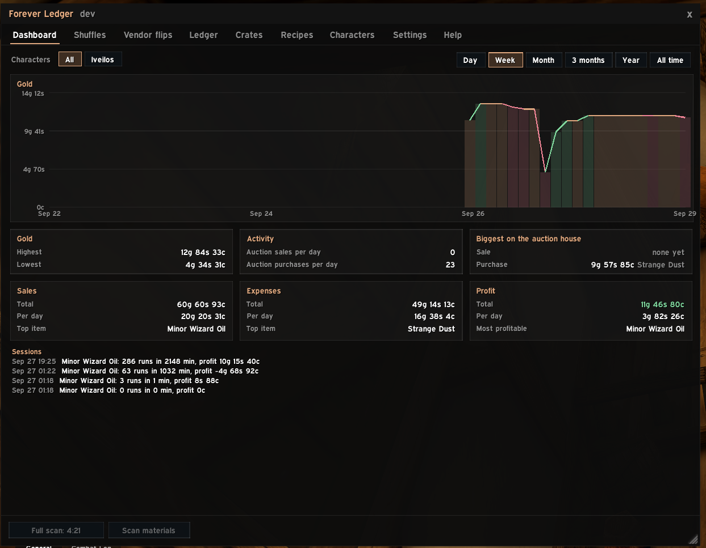
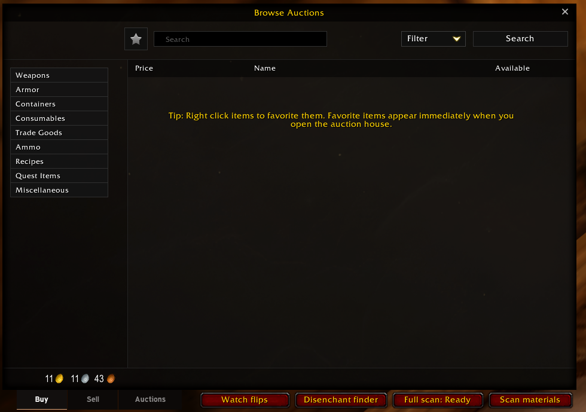
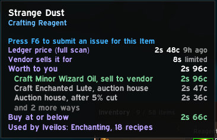
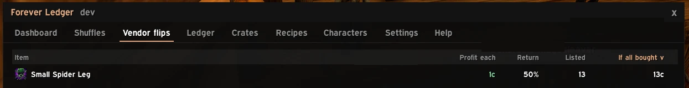
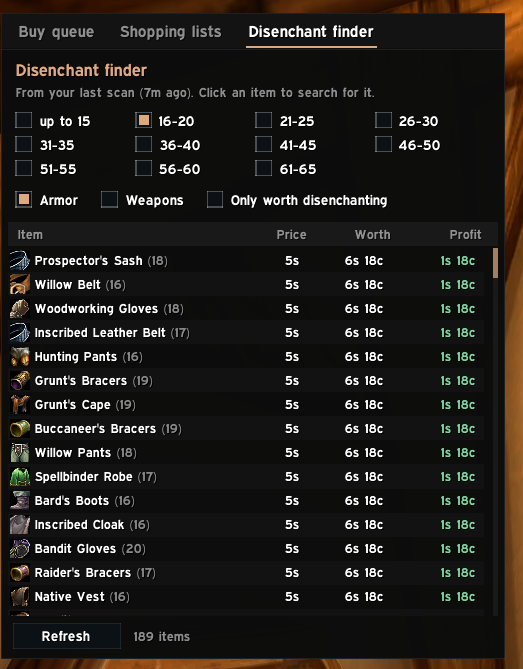
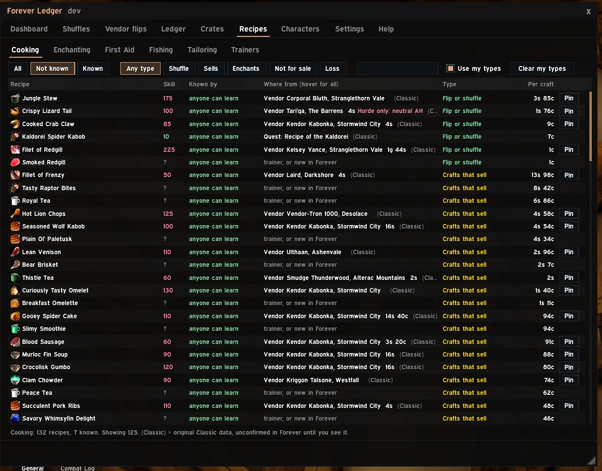
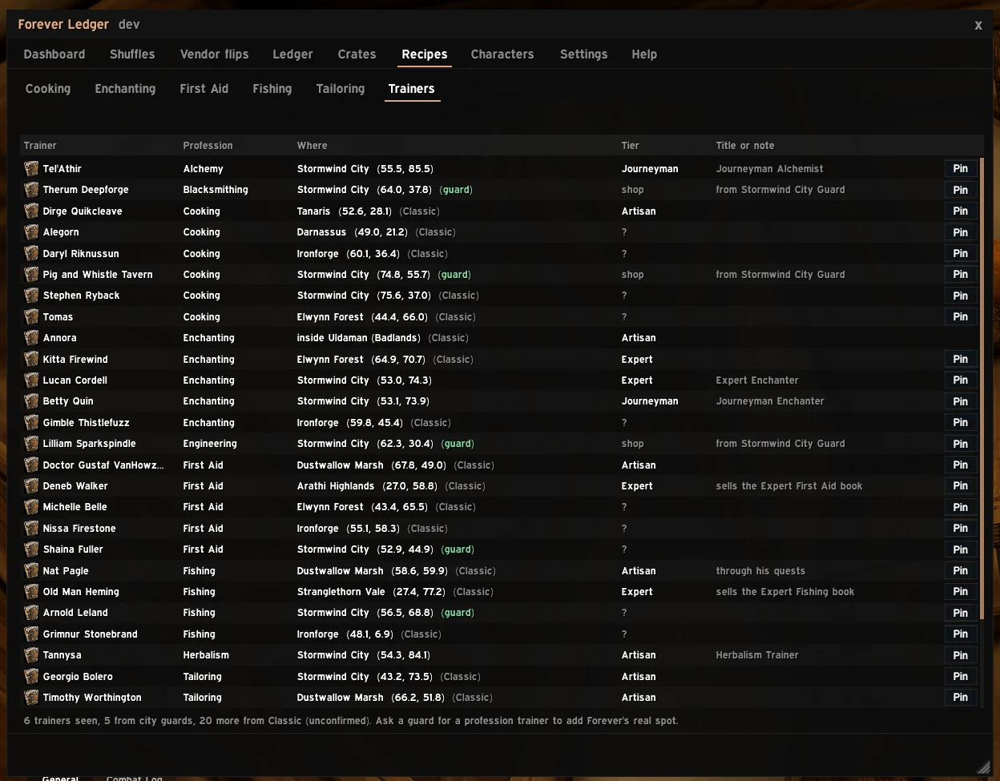
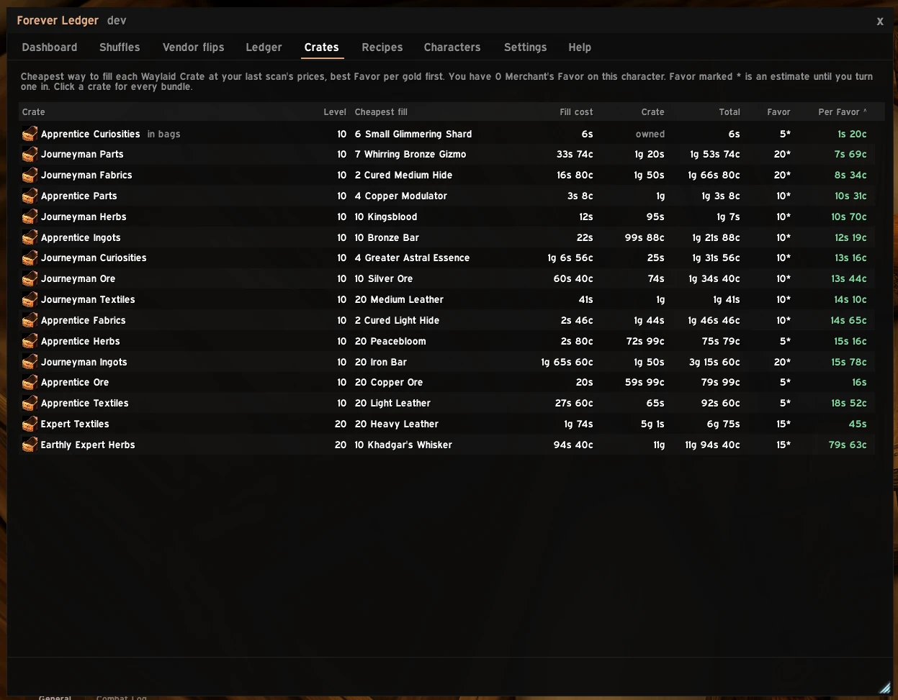
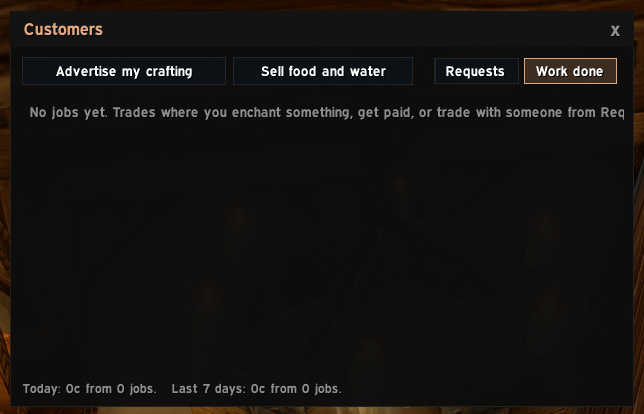

# Forever Ledger guide

Everything the addon does, at a high level. The same text is in the game under **/fl → Help**. For what changed in each version see the [changelog](../CHANGELOG.md); for what's coming, the [roadmap](../ROADMAP.md).

> Pictures are being added. Where a picture is missing, the text still describes the feature.

## Getting started

1. Type `/fl` (or click the minimap button) to open the main window.
2. Open each profession window once on every character, so the addon learns your recipes.
3. At the auction house, click **Full scan** (allowed about every 15 minutes) to price everything.
4. Hover any item: the tooltip shows what it's worth to you.

## Scanning the auction house

- **Full scan** reads every listing in a few seconds. **Scan materials** checks just what your recipes use.
- **Watch flips** keeps scanning while the auction house stays open and chimes when a new vendor flip turns up. An eye on the button shows it's running.
- If Auctionator or another addon runs a full scan, Forever Ledger reads it too.
- Neutral auction houses (Booty Bay, Gadgetzan, Everlook) keep their own prices.

## Tooltips

- **Worth to you**: the best of selling on the auction house, selling to a vendor, disenchanting, or crafting it into something, with the best few ways listed.
- **Buy at or below**: the most worth paying, after your safety margin. Green when it's already cheaper.
- Also: disenchant results, which of your recipes use it, and the cheapest crate fill.
- Gear with random stats ("of the Eagle"): the price of that exact version, since versions of one item can sell for very different amounts.
- **Settings → Tooltip size**: "One line, Shift for more" keeps tooltips short. Each part can be turned off.

## Shuffles and vendor flips

- **Shuffles**: buy materials, craft, disenchant or convert, and sell, ranked by profit per hour. Click a row for every step; **Work it** walks you through them with one-click buttons.
- **Vendor flips**: things on the auction house for less than a vendor pays. After a scan finds some, the tab opens by itself; click a flip to search for it. On the auction house, listings worth buying get a green bar and a **BUY** badge, and the line above the list says how many are still there (red "None left" once they've been bought).

## Disenchanting

- **Disenchant finder** (beside the auction house): green armor and weapons by item level, with what each is worth to disenchant. Hover a band for the odds of each material.
- The **Disenchant** button in Work it disenchants the shuffle's items one click at a time. `/fl de` shows your own results.

## Recipes and trainers

- **Recipes tab**: every recipe of your professions, who knows it, where to get it, the skill needed, and profit per craft. Types: Flip or shuffle, Crafts that sell, Enchant service, Not for sale, Not profitable. Right-click a recipe to set your own type.
- **Where from**: what you've seen in game first, otherwise original Classic data marked "(Classic)", or the auction house when the recipe item is listed there (handy for recipes new in Forever). **Pin** puts a map pin on the vendor, trainer or mob.
- **Trainers view**: trainers you've visited, Classic ones, and the spots city guards mark when you ask them for a profession trainer (marked "guard").

## Waylaid Crates

- **Crates tab**: the cheapest way to fill each crate at today's prices, with the crate's own price and gold per Merchant's Favor. Click a crate for every bundle and what you already have in bags, bank and alts.

## Customers and work

- **Customers window** (`/fl customers`): opens when someone in chat asks for what your character can do, with **Whisper** and **Invite** buttons.
- **Ad buttons** post your crafting (with profession links) or, on a Mage, food and water (with links) to Trade. Right-click to change the text.
- **Work done** (`/fl work`): enchants and paid trades, with today's and this week's earnings.

## Your gold

- **Dashboard**: gold over time, sales, expenses and profit, and your sessions.
- **Ledger**: every sale and purchase, resale profit, and other money like repairs and flights.

## Sharing between accounts

- **Live sync** (`/fl pair First Last`) sends prices and recipes between your two accounts while both are online. Export and import work too.

## Commands

| Command | What it does |
|---|---|
| `/fl` | Open or close the window |
| `/fl scan` | Full scan if allowed, otherwise your materials |
| `/fl watch` | Start or stop the flip watch |
| `/fl customers`, `/fl work` | The Customers window, or its Work done view |
| `/fl de` | Your disenchant results |
| `/fl deals` | Current deals |
| `/fl book` | Recipe data gathered so far |
| `/fl sync` | Sync status and help |
| `/fl perf` | What takes the addon's time |
| `/fl probe` | Checks what the game supports (for testing) |
